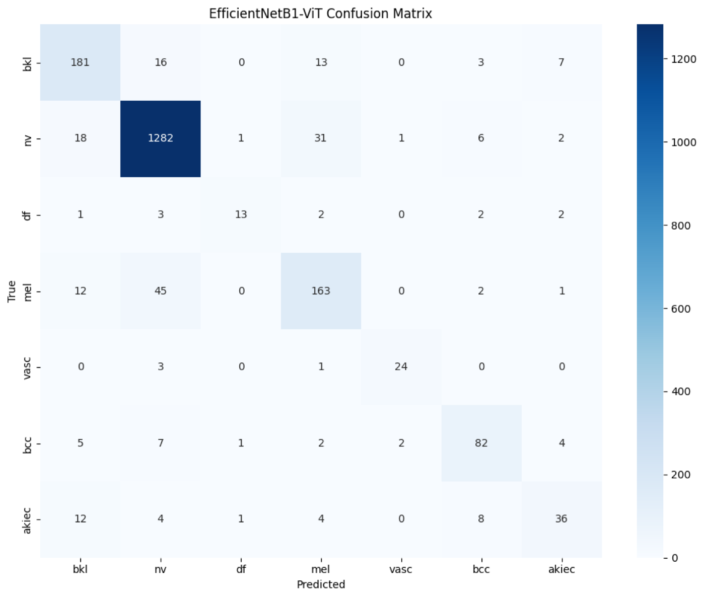
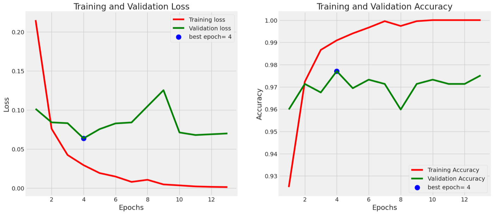
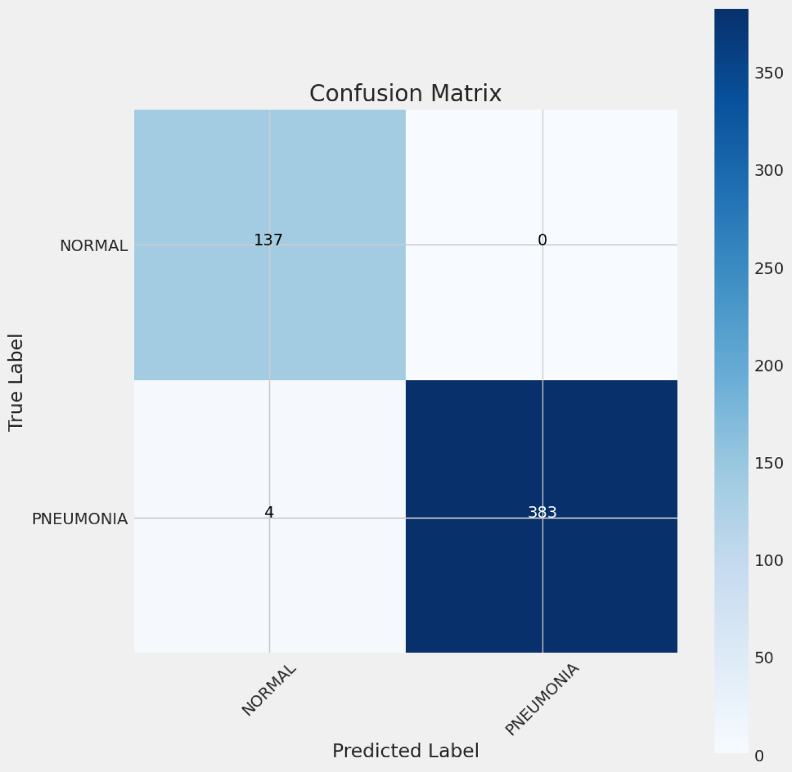
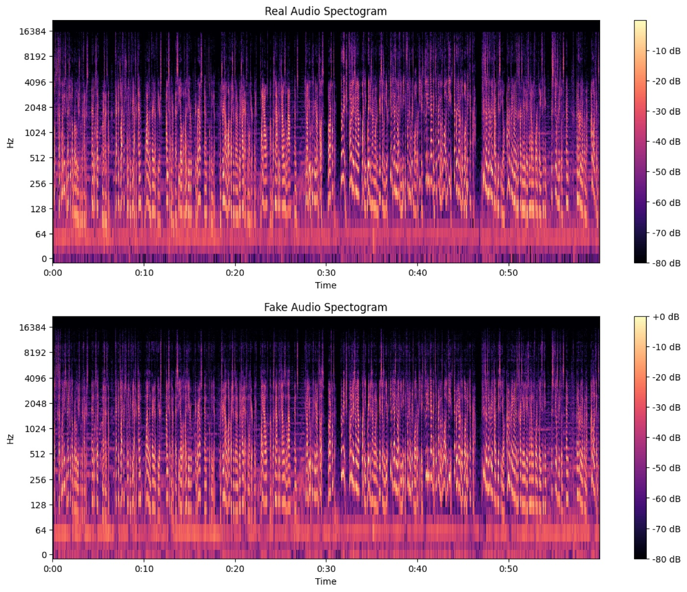
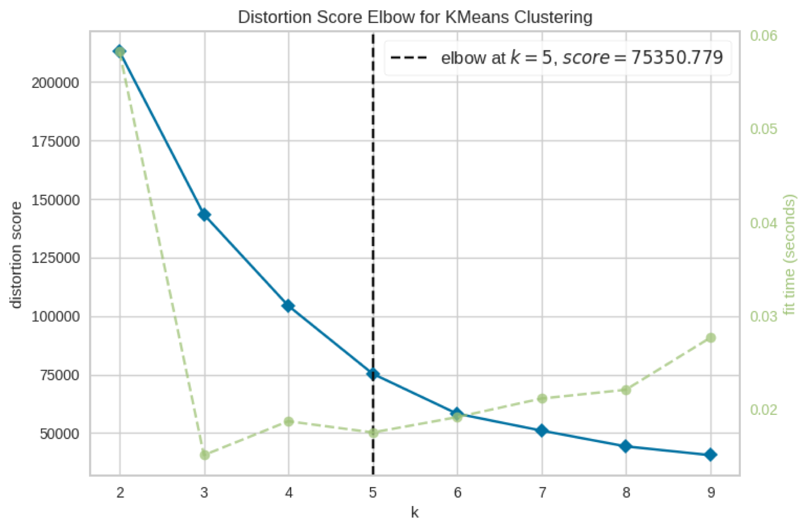
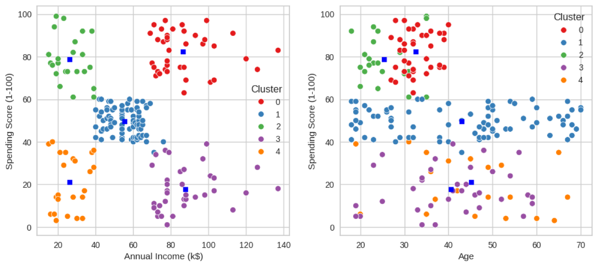

# Machine Learning Portfolio

*Applied machine learning and computer vision projects spanning medical imaging, biometric verification, NLP, audio processing, and mobile integration.*

I am a Computer Science student at Bina Nusantara University specializing in Artificial Intelligence. This repository collects my machine learning projects — each directory contains a self-contained notebook with code and result plots, and two related projects are linked out to their own repositories. The emphasis throughout is on building deployable, real-world AI solutions rather than toy examples: an undergraduate thesis published in a scientific journal, a face-verification API running live on Hugging Face, and an ML model shipped inside a native iOS app.

LinkedIn: https://www.linkedin.com/in/christian-luis-efendy-53b25a217/

## Skin Disease Detection with a Hybrid CNN-Transformer (Undergraduate Thesis)

The headline project — and my undergraduate thesis — classifies skin lesions in dermatoscopic images using a hybrid architecture that combines an EfficientNet-B1 CNN for local feature extraction with a Vision Transformer for global context. Designed for real-world diagnostic assistance and published in a scientific journal.

*Training and validation curves of the EfficientNetB1-ViT hybrid: validation accuracy climbs to roughly 89% over 17 epochs while training accuracy approaches 98%.*

The notebook is a full architecture study, not a single model: it trains and compares standalone EfficientNet-B0/B1/B2/B3, a standalone ViT, and B0/B1/B2/B3-ViT hybrids on the same seven-class lesion dataset, each with its own training history, classification report, and confusion matrix.

*Confusion matrix of the EfficientNetB1-ViT hybrid on the held-out set: 1,781 of 2,003 images land on the diagonal (about 89%), with the hardest confusion — as in most skin-lesion work — between melanoma and benign nevi.*

Directory: `ViT-EfficientNet Hybrid/`

## IPC Similarity Verifier - Face Matching and Liveness Detection

Verifies that the person in a selfie matches the photo on an uploaded KTP (Indonesian ID card) and runs a liveness (anti-spoofing) check. Built with Flask, OpenCV, DeepFace, and Gunicorn. All images are processed in memory only — nothing is stored or collected.

Live demo (Hugging Face): https://c-luis-e-ipc-similarity-verifier.hf.space

- `POST /api/verify` — multipart `ktp_image` + `selfie_image`; returns `matched`, `distance`, `threshold`, and a message
- `POST /api/liveness` — multipart `image`; returns `liveness_passed` and a confidence score

## Wise Frame - Face and Eyewear Matching (iOS)

Mobile app that recommends eyeglass frames from face shape, skin tone, and facial proportions. A Python ML model (facial landmark extraction for face-shape detection) is integrated into a native SwiftUI app with an ARKit virtual try-on, product listings, and onboarding. Stack: SwiftUI, ARKit, Vision, MediaPipe, Python, CoreML.

*Facial landmark extraction driving the face-shape classifier that powers the app's frame recommendations.*

The `Facial Shape Detector/` directory holds the face-shape model notebook and the Swift landmark generator.
App repository: https://github.com/celine1906/C8S2-MLChallenge-WiseFrame

## Pose to Impress

Real-time pose correction from webcam or mobile input for fitness and dance posture tracking, built with OpenCV and MediaPipe.
Repository: https://github.com/LuisSsiuL/pose-to-impress

## Pneumonia Detection from Chest X-Rays

A CNN classifier labelling chest X-rays as Normal or Pneumonia, trained with image augmentation and evaluated with standard classification metrics.

*A labelled training batch from the dataset — the visual difference between clear and consolidated lungs is subtle enough that an untrained eye misses many of them.*

Training converges quickly, with the model checkpoint selecting the best epoch on validation loss:

*Loss and accuracy over training; the callback marks epoch 4 as the best validation checkpoint, with validation accuracy holding near 97%.*

*Test-set confusion matrix from the notebook outputs: 520 of 524 X-rays classified correctly (99.2%) — zero false alarms on normal scans and only four pneumonia cases missed.*

Directory: `Pneumonia Classification/`

## DeepFake Audio Detection

A deep learning system that detects synthetic audio using CNNs over audio features such as MFCCs and spectrograms. The exploratory half of the notebook is an audio-forensics tour: waveforms, STFT spectrograms, mel spectrograms, chromagrams, and MFCCs are computed side by side for genuine and synthetic recordings.

*STFT spectrograms of a real recording (top) and a deepfake (bottom) from the notebook — nearly indistinguishable to the eye, which is exactly why the classifier works from engineered audio features rather than raw listening.*

*Chromagram of a synthetic audio sample — one of the feature representations explored for separating real from fake.*

Directory: `Deep Fake Detection/`

## AI Text Detector and Plagiarism Checker

A two-part NLP pipeline: a stacked-LSTM network trained on labelled sentence pairs for plagiarism detection, and an AI-vs-human text classifier that constructs its own dataset (GPT-2 generations seeded with Project Gutenberg prompts) and classifies SBERT sentence embeddings with Multinomial Naive Bayes.
Directory: `AI Text Detector/`

## Scientific Paper Summarizer

An extractive summarizer tailored to software engineering documents, built on TF-IDF and TextRank with custom NLP preprocessing.
Directory: `Scientific Paper Summarizer/`

## Satria Data Competition Insights

Exploratory analysis of participant demographics and trends in Indonesia's Satria Data competition, using Matplotlib, Seaborn, and Plotly.

*One of the notebook's demographic breakdowns of competition participants.*

Directory: `Sentiment Analysis/`

## Customer Segmentation with Clustering

Segments mall customers by demographics and spending habits using K-Means (Elbow Method, Silhouette Score), DBSCAN for outlier detection, and hierarchical clustering with dendrograms.

*The distortion-score elbow lands cleanly on k = 5 for the K-Means model.*

*The five resulting segments plotted against annual income and age — the classic mall-customer structure (high-income savers, high-income spenders, and the mid-market core) emerges clearly.*

*Hierarchical clustering recovers essentially the same five segments, a useful cross-check on the K-Means result.*

Directory: `AI Clustering/`

## Classical ML Foundations

- Diabetes prediction — logistic regression binary classifier over health indicators (`Logistic Regression/`)
- Linear regression implemented from scratch with NumPy and visualized with Matplotlib (`Linear Regression/`)

*The from-scratch least-squares fit — no scikit-learn, just NumPy.*

## Tech Stack

Python, TensorFlow/Keras, PyTorch, scikit-learn, OpenCV, MediaPipe, Hugging Face Transformers, Sentence-Transformers, NLTK, Flask, Matplotlib, Seaborn, Plotly, and (for Wise Frame) SwiftUI, ARKit, and CoreML.

## Repository Structure

Each project lives in its own directory with its notebook and a result snapshot:

- `ViT-EfficientNet Hybrid/` — thesis: hybrid CNN-Transformer skin lesion classifier
- `Facial Shape Detector/` — Wise Frame face-shape model and Swift landmark generator
- `Pneumonia Classification/`, `Deep Fake Detection/` — medical imaging and audio deepfake CNNs
- `AI Text Detector/`, `Scientific Paper Summarizer/`, `Sentiment Analysis/` — NLP and analytics
- `AI Clustering/`, `Logistic Regression/`, `Linear Regression/` — classical ML
- `docs/images/` — figures extracted from the notebooks for this README
